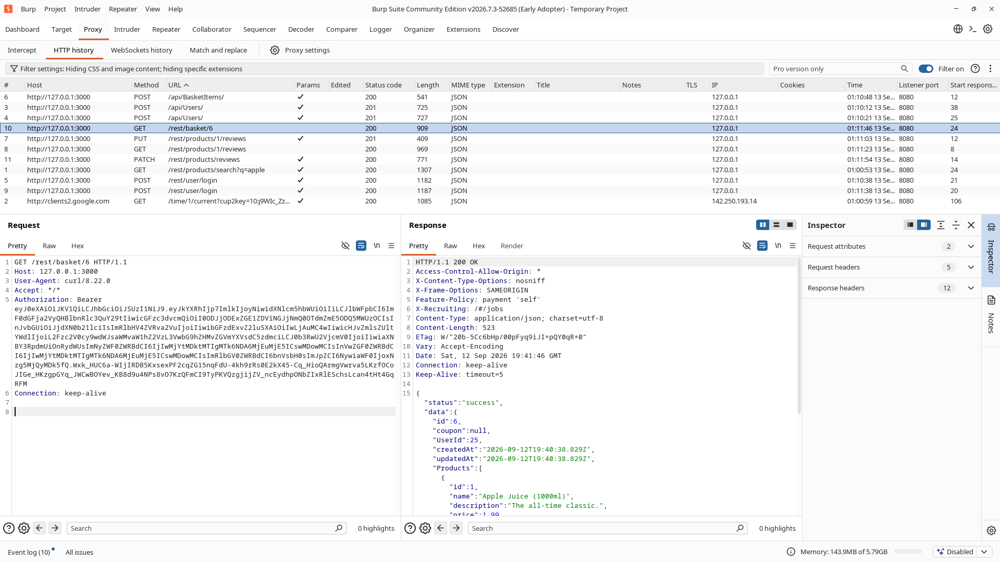
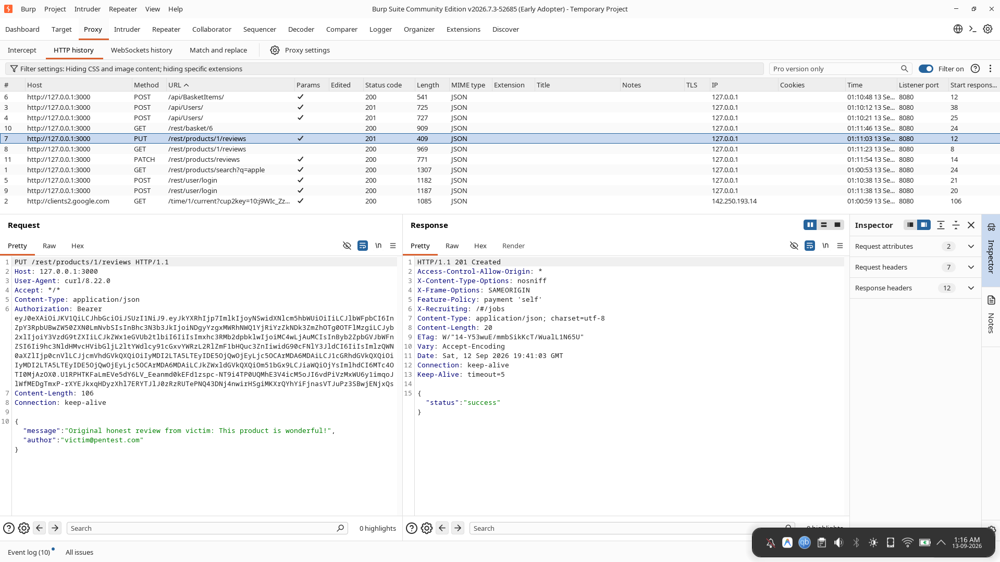
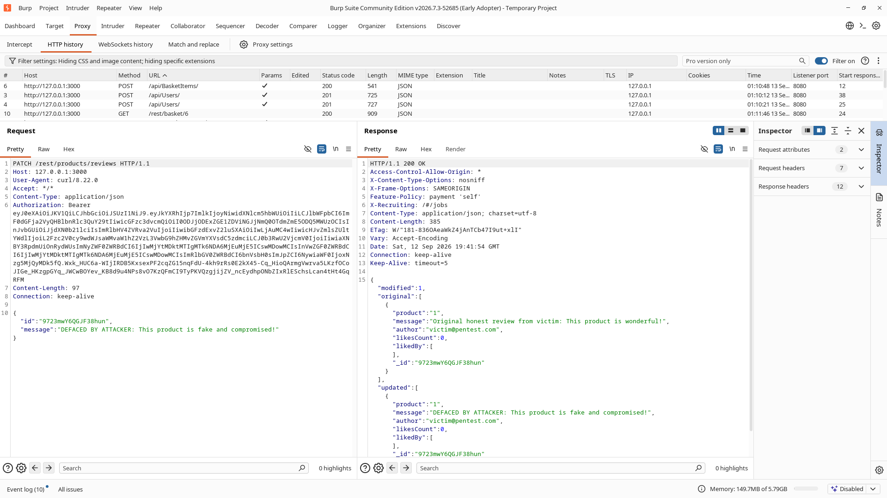
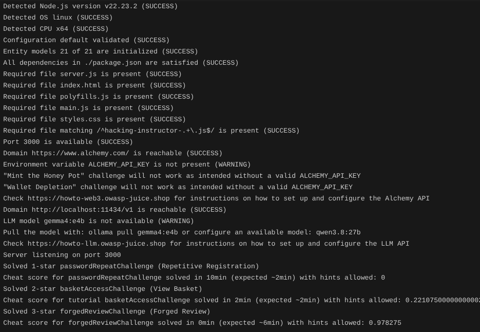

# Insecure Direct Object References (IDOR) – Multiple Access Control Contexts

## Severity: High

**OWASP Classification**
- A01:2021 – Broken Access Control
- A01:2025 – Broken Access Control

**CWE**
- CWE-639 – Authorization Bypass Through User-Controlled Key
- CWE-285 – Improper Authorization

---

## 1. Executive Summary

While testing OWASP Juice Shop, I identified two separate Insecure Direct Object Reference (IDOR / BOLA) vulnerabilities in the application's REST APIs:

1. **Read IDOR – Shopping Basket Exposure (`GET /rest/basket/:id`):** An authenticated user can inspect any customer's shopping cart, item quantities, and pricing simply by changing the ID in the URL.
2. **Write IDOR – Product Review Tampering (`PATCH /rest/products/reviews`):** An authenticated user can overwrite, deface, or alter any product review by passing the review ID in the JSON body.

In both cases, authentication is present (JWT token), but object-level authorization is missing: the server accepts client-supplied IDs without checking whether the requester owns the target resource. Baseline testing also confirmed that the application had zero security logging for access control violations, allowing these actions to go unnoticed.

---

## 2. Application Context

### Target Endpoints

```text
GET /rest/basket/:id
PATCH /rest/products/reviews
```

### Authentication Mechanism
- Successful logins return a signed JWT token containing user metadata (`data.id`, `data.email`, `data.role`) and their assigned shopping basket ID (`bid`).
- Requests to protected endpoints pass this token via the `Authorization: Bearer <token>` header or a cookie.
- **The Defect:** Although the server decodes the token and knows who the user is, the route handlers never compare the user's identity against the requested record IDs.

---

## 3. Technical Description & Proof of Concept

### 3.1 Vector 1: Read IDOR – Shopping Basket Exposure

#### Vulnerability Description
When viewing a cart, the client requests `GET /rest/basket/:id`. The backend handler (`routes/basket.ts`) takes `req.params.id` and queries `BasketModel.findOne({ where: { id } })`.

Because it never validates whether `req.params.id` matches the user's own `bid`, any logged-in user can enumerate basket IDs (`/rest/basket/1`, `/rest/basket/2`, etc.) and view other customers' carts.

#### Steps to Reproduce
1. Log in as a victim account (`victim@pentest.com`, User ID 25, Basket ID 6) and add products to the cart (e.g., 2x Apple Juice).
2. Log in as an attacker account (`attacker@pentest.com`, User ID 26, Basket ID 7).
3. In Burp Suite Repeater, send a request to view Basket 6 using the attacker's token:
   ```http
   GET /rest/basket/6 HTTP/1.1
   Host: 127.0.0.1:3000
   Authorization: Bearer <attacker_jwt_token>
   ```

#### Result
The server responds with `HTTP 200 OK` and returns the victim's full cart contents, exposing product IDs, quantities, and pricing.

#### Evidence – Unauthorized Basket Access via Read IDOR

Burp Repeater capture showing `attacker@pentest.com` successfully retrieving the private shopping basket of `victim@pentest.com` (Basket ID 6).



---

### 3.2 Vector 2: Write IDOR – Product Review Tampering

#### Vulnerability Description
Product reviews are stored in a document collection (`posts`). When a user edits a review, the frontend sends a `PATCH` request to `/rest/products/reviews` with the review ID and the updated message.

The route handler (`routes/updateProductReviews.ts`) runs an update query matching only `{ _id: req.body.id }`. It never verifies that the authenticated user's email matches the `author` field of the existing review. As a result, any user can modify or deface reviews published by other users.

#### Steps to Reproduce
1. Identify an existing review published by `victim@pentest.com` (Review ID: `9723mwY6QGJF38hun`).

#### Evidence – Baseline Original Review Created by Victim Account

Burp capture of the legitimate review created by `victim@pentest.com` before tampering.



2. Authenticate as `attacker@pentest.com`.
3. In Burp Repeater, send a `PATCH` request targeting the victim's review ID with an altered message:
   ```http
   PATCH /rest/products/reviews HTTP/1.1
   Host: 127.0.0.1:3000
   Content-Type: application/json
   Authorization: Bearer <attacker_jwt_token>

   {
     "id": "9723mwY6QGJF38hun",
     "message": "DEFACED BY ATTACKER: This product is fake and compromised!"
   }
   ```

#### Result
The server returns `HTTP 200 OK` with `{"modified": 1}`, and the review in the database is overwritten.

#### Evidence – Successful Unauthorized Review Tampering

Burp Repeater capture showing the attacker modifying and defacing the victim's review.



---

## 4. Root Cause Analysis

Both vulnerabilities occur because the backend relies on client-provided IDs without verifying object ownership.

### Basket Route (`routes/basket.ts`)
```typescript
export function retrieveBasket () {
  return async (req: Request, res: Response, next: NextFunction) => {
    const id = req.params.id
    // Queries database by ID directly with no ownership check
    const basket = await BasketModel.findOne({ where: { id }, ... })
    res.json(utils.queryResultToJson(basket))
  }
}
```
The handler extracts `req.params.id` from the URL path. It never compares this value to `user.bid` from the authenticated session.

### Review Route (`routes/updateProductReviews.ts`)
```typescript
export function updateProductReviews () {
  return (req: Request, res: Response, next: NextFunction) => {
    // Updates review matching only the ID, ignoring the author
    db.reviewsCollection.update(
      { _id: req.body.id },
      { $set: { message: req.body.message } },
      { multi: true }
    ).then((result) => res.json(result))
  }
}
```
The query filter only specifies `{ _id: req.body.id }`. It does not verify that `review.author === user.data.email`.

---

## 5. Impact Analysis

### Security Impact
- **Confidentiality (Read IDOR):** An attacker can iterate through basket IDs (`/rest/basket/1` through `N`) and dump cart contents, pricing, and purchase intentions for all users across the platform.
- **Integrity (Write IDOR):** An attacker can deface, overwrite, or delete any user's product reviews, including those from verified admins, damaging platform reputation and user trust.
- **Account Impersonation:** An attacker can alter public content under another user's identity without needing their password or session token.

### Detection Impact
Baseline testing showed no security telemetry when foreign objects were accessed or modified. The server only logged CTF challenge trigger events, meaning an attacker could scrape carts or tamper with reviews without generating any access control alerts.

#### Evidence – Unpatched Server Logs

Server console output during baseline testing showing no authorization failure logs.



---

## 6. Risk Rating Justification

| Factor | Evaluation | Rationale |
| :--- | :--- | :--- |
| **Attack Complexity** | **Low** | Requires simple parameter editing in URLs or JSON bodies. |
| **Privileges Required** | **Low** | Any standard authenticated account is sufficient. |
| **User Interaction** | **None** | Exploitation requires no victim interaction. |
| **Scope** | **Changed** | The attacker accesses and modifies resources belonging to other users. |
| **Confidentiality** | **High** | Full access to private cart data across all users. |
| **Integrity** | **High** | Direct modification and defacement of stored user reviews. |
| **Detection Difficulty** | **High** | Baseline application lacked any audit logging for access violations. |

Overall Severity: **High**

---

## 7. Recommended Remediation

1. **Enforce Object Ownership on Basket Access:**
   In `routes/basket.ts`, compare the requested basket ID against `user.bid`. Allow the request only if the IDs match or if the user is an admin (`user.data.role === security.roles.admin`).
2. **Validate Review Author on Updates:**
   In `routes/updateProductReviews.ts`, retrieve the review first and verify that `review.author === user.data.email` before running the update.
3. **Return Standard Error Codes:**
   Reject unauthorized requests with `HTTP 403 Forbidden` and a clear error message.
4. **Add Security Audit Logging:**
   Log all access control rejections (`ACCESS_DENIED_IDOR`) with the user ID, attempted object ID, actual assigned ID, and IP address for SIEM monitoring.

---

## 8. Vulnerability Status (Pre-Hardening)

| Control | Status |
| :--- | :--- |
| Basket ownership verification | ❌ Not implemented |
| Review author validation | ❌ Not implemented |
| Administrative role checks | ❌ Not implemented |
| Access violation audit logging | ❌ Not implemented |

**Status: Vulnerable**
