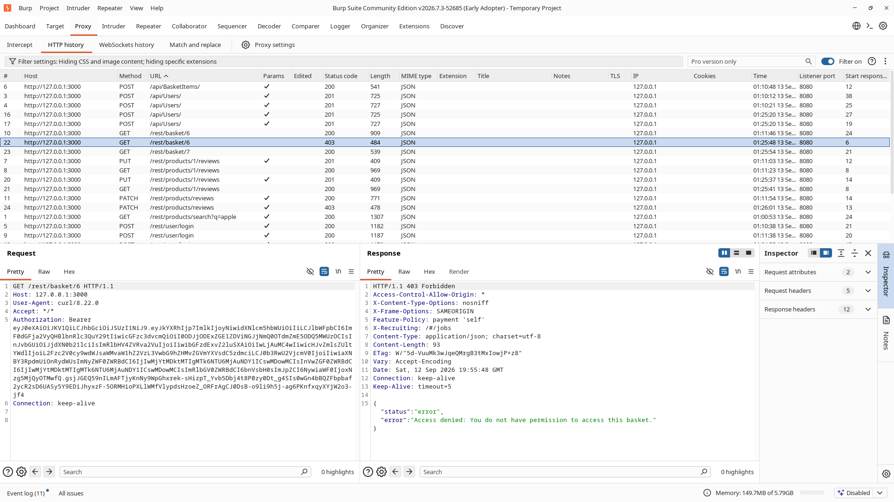
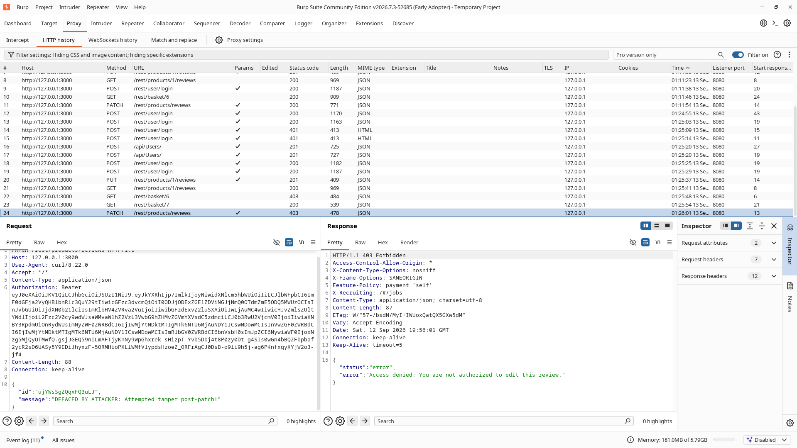
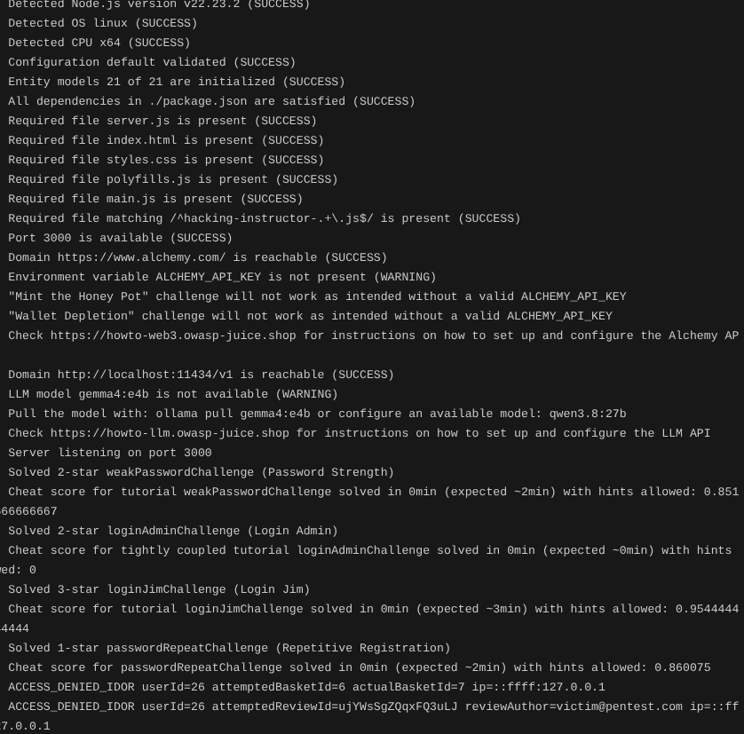

# Insecure Direct Object References (IDOR) – Retest Results

## 1. Objective

After applying the defensive patches to `routes/basket.ts` and `routes/updateProductReviews.ts`, I retested both IDOR attack vectors to verify that:

1. Unauthorized requests targeting foreign objects are blocked with `HTTP 403 Forbidden`.
2. Each blocked attempt produces an `ACCESS_DENIED_IDOR` audit log with full metadata.
3. Legitimate user access (accessing own basket, editing own review) remains fully functional.

---

## 2. Retest Procedures & Results

### 2.1 Vector 1: Shopping Basket IDOR (`GET /rest/basket/:id`)

#### Retest Procedure
Using Burp Repeater, I replayed the exact request targeting the victim's basket (`id: 6`) using the attacker's active token (`bid: 7`):

```http
GET /rest/basket/6 HTTP/1.1
Host: 127.0.0.1:3000
Authorization: Bearer <attacker_jwt_token>
```

#### Result
- **Status:** `403 Forbidden`
- **Response:**
  ```json
  {
    "status": "error",
    "error": "Access denied: You do not have permission to access this basket."
  }
  ```
- **Outcome:** Blocked. The server refused to return the foreign basket data.

#### Evidence – Shopping Basket IDOR Blocked (HTTP 403 Forbidden)

Burp capture showing the unauthorized basket request returning `HTTP 403 Forbidden`.



#### Baseline Check (Legitimate Access)
To verify no regression, I tested retrieving the attacker's own assigned basket (`id: 7`):
```http
GET /rest/basket/7 HTTP/1.1
Host: 127.0.0.1:3000
Authorization: Bearer <attacker_jwt_token>
```
- **Status:** `200 OK`
- **Outcome:** Returned the attacker's own cart normally, confirming legitimate functionality is intact.

---

### 2.2 Vector 2: Product Review IDOR (`PATCH /rest/products/reviews`)

#### Retest Procedure
Using Burp Repeater, I replayed the `PATCH` request targeting the victim's review ID (`ujYWsSgZQqxFQ3uLJ`) with an altered message:

```http
PATCH /rest/products/reviews HTTP/1.1
Host: 127.0.0.1:3000
Content-Type: application/json
Authorization: Bearer <attacker_jwt_token>

{
  "id": "ujYWsSgZQqxFQ3uLJ",
  "message": "DEFACED BY ATTACKER: Attempted tamper post-patch!"
}
```

#### Result
- **Status:** `403 Forbidden`
- **Response:**
  ```json
  {
    "status": "error",
    "error": "Access denied: You are not authorized to edit this review."
  }
  ```
- **Outcome:** Blocked. The victim's original review in the database remained untouched.

#### Evidence – Product Review IDOR Blocked (HTTP 403 Forbidden)

Burp capture showing unauthorized review modification returning `HTTP 403 Forbidden`.



---

## 3. Server-Side Telemetry Verification

I monitored the server console during both retest attempts. The server logged structured security warnings with the attacker's user ID, target object ID, actual assigned ID, and IP address:

```text
warn: ACCESS_DENIED_IDOR userId=26 attemptedBasketId=6 actualBasketId=7 ip=::ffff:127.0.0.1
warn: ACCESS_DENIED_IDOR userId=26 attemptedReviewId=ujYWsSgZQqxFQ3uLJ reviewAuthor=victim@pentest.com ip=::ffff:127.0.0.1
```

#### Evidence – Patched Server Security Telemetry Logs

Server console output confirming real-time `ACCESS_DENIED_IDOR` warnings during retest.



---

## 4. Final Validation Summary

| Test Case | Pre-Patch Behavior | Post-Patch Behavior | Result | Status |
| :--- | :--- | :--- | :---: | :---: |
| **Vector 1: Basket IDOR** | HTTP 200 OK (Victim cart leaked) | HTTP 403 Forbidden | Blocked | ✅ Closed |
| **Vector 1: Own Basket** | HTTP 200 OK (Own cart returned) | HTTP 200 OK (Own cart returned) | Maintained | ✅ Validated |
| **Vector 2: Review IDOR** | HTTP 200 OK (Review overwritten) | HTTP 403 Forbidden | Blocked | ✅ Closed |
| **Vector 2: Stored Content** | Overwritten by attacker | Original review preserved | Maintained | ✅ Closed |
| **Security Telemetry** | Silent execution (Zero logs) | Structured `ACCESS_DENIED_IDOR` logs | Logged | ✅ Verified |

---

## 5. Final Status

**Insecure Direct Object Reference (IDOR) Vulnerabilities: CLOSED**

Both attack paths have been mitigated with server-side authorization checks, confirmed via retesting, and instrumented with security audit logging.
