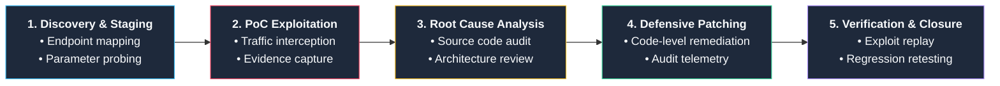

<div align="center">

# WebApp-Sec-Lab

**A hands-on Application Security & Defensive Engineering laboratory documenting the full vulnerability management lifecycle: discovery, exploitation, code-level root cause analysis, defensive patch engineering, and retest verification.**

<br/>

[-e24d0e?style=for-the-badge&logo=owasp&logoColor=white)](https://owasp.org/www-project-top-ten/)
[](https://owasp-juice.shop)
[](https://portswigger.net/burp)
[](https://github.com)

</div>

---

## Overview

Most web application security labs end at the exploit stage. **WebApp-Sec-Lab** takes the engineering workflow further by treating vulnerabilities as complete software defects requiring forensic root-cause analysis, source-code remediation, and post-fix validation.

Each module in this repository demonstrates the five core phases of professional Application Security (AppSec) engagements:



---

## Vulnerability Modules Matrix

| Module | Category | Primary Weakness | Target Endpoints | Severity | Status | Reports |
| :--- | :--- | :--- | :--- | :---: | :---: | :---: |
| **[Broken Authentication](./broken-authentication/)** | Broken Authentication | JWT session reuse after logout; lack of server-side token invalidation | `POST /rest/user/login`<br>`GET /rest/user/whoami` | **High**<br>`CWE-287` | ✅ Closed | [01](./broken-authentication/01-broken-authentication-report.md) • [02](./broken-authentication/02-detection-observability-logging.md) • [03](./broken-authentication/03-prevention-token-revocation.md) • [04](./broken-authentication/04-retest-results.md) |
| **[Cross-Site Scripting (XSS)](./XSS/)** | Injection | Sanitizer bypasses; unsafe DOM rendering across DOM, Reflected, and Stored contexts | `/search?q=`<br>`/track-order?id=`<br>`/api/Feedbacks` | **High**<br>`CWE-79` | ✅ Closed | [01](./XSS/01-xss-vulnerability-assessment.md) • [02](./XSS/02-prevention-xss-hardening.md) • [03](./XSS/03-retest-results.md) |
| **[IDOR & BOLA](./IDOR/)** | Broken Access Control | Missing object-level authorization on basket reads and product review updates | `GET /rest/basket/:id`<br>`PATCH /rest/products/reviews` | **High**<br>`CWE-639` | ✅ Closed | [01](./IDOR/01-idor-vulnerability-assessment.md) • [02](./IDOR/02-prevention-idor-hardening.md) • [03](./IDOR/03-retest-results.md) |

---

## Module Summaries

### 1. [Broken Authentication – Session Reuse After Logout](./broken-authentication/)
* **The Flaw:** When users logged out, the client simply discarded the cookie, but the server maintained no record of revoked JWTs. An attacker with a captured token could replay it indefinitely to access protected endpoints (`GET /rest/user/whoami`).
* **The Fix:** Implemented an in-memory token revocation store (`revokedTokens` set in `lib/insecurity.ts`), verified tokens in authentication middleware before signature checking, and created a dedicated backend logout route (`POST /rest/user/logout`).
* **Telemetry Added:** `LOGIN_SUCCESS`, `TOKEN_USED`, `LOGOUT`, and `TOKEN_REJECTED` audit events.

### 2. [Cross-Site Scripting (XSS) – Multi-Context Hardening](./XSS/)
* **The Flaw:** Identified three distinct injection sinks: DOM XSS in search results, Reflected XSS in order tracking, and Stored XSS in customer feedback rendered in the administrative dashboard. Each used Angular sanitizer bypasses (`bypassSecurityTrustHtml`).
* **The Fix:** Removed sanitizer bypasses across Angular components, converted vulnerable `[innerHTML]` bindings to safe Angular interpolation (`{{ }}`), and applied explicit `DomSanitizer.sanitize(SecurityContext.HTML)` filtering for user comments.
* **Retest Result:** All payloads render as inert plain text without executing JavaScript or alert popups.

### 3. [Insecure Direct Object References (IDOR / BOLA)](./IDOR/)
* **The Flaw:** Tested two access control vectors:
  * **Read IDOR:** `GET /rest/basket/:id` queried the database by primary key without checking if the requester owned the cart, leaking private cart contents.
  * **Write IDOR:** `PATCH /rest/products/reviews` updated reviews matching only the document ID, allowing any authenticated user to deface reviews posted by other customers or admins.
* **The Fix:** Bound basket lookups to session ownership (`user.bid === requestedId`) and verified review authorship (`review.author === user.data.email`) while retaining administrative role overrides.
* **Telemetry Added:** Emitted real-time `ACCESS_DENIED_IDOR` warnings for access control violations.

---

## Standard Module Layout

Every module in this repository follows a consistent, auditable four-part structure:

```text
<module-directory>/
├── README.md                              # Module overview & document navigation index
├── 01-<vuln>-vulnerability-assessment.md # Technical assessment, PoC steps, & evidence
├── 02-prevention-<vuln>-hardening.md      # Code remediation diffs & architecture rationale
├── 03-retest-results.md                   # Replay verification & closure documentation
├── evidence/                              # High-resolution Burp Suite & server log captures
└── patches/                               # Complete drop-in source files for the target app
```

---

## Repository Structure

```text
webapp-sec-lab/
├── README.md                              # Main lab documentation and project index
│
├── broken-authentication/
│   ├── README.md
│   ├── 01-broken-authentication-report.md
│   ├── 02-detection-observability-logging.md
│   ├── 03-prevention-token-revocation.md
│   ├── 04-retest-results.md
│   ├── evidence/                          # 11 screenshots (Burp Repeater, cookies, logs)
│   └── patches/                           # insecurity.ts, login.ts, server.ts
│
├── XSS/
│   ├── README.md
│   ├── 01-xss-vulnerability-assessment.md
│   ├── 02-prevention-xss-hardening.md
│   ├── 03-retest-results.md
│   ├── evidence/                          # 13 screenshots (payload staging, alerts, safe render)
│   └── patches/                           # search-result, track-result, administration
│
└── IDOR/
    ├── README.md
    ├── 01-idor-vulnerability-assessment.md
    ├── 02-prevention-idor-hardening.md
    ├── 03-retest-results.md
    ├── evidence/                          # 7 screenshots (PoC leaks, review defacement, 403s)
    └── patches/                           # basket.ts, updateProductReviews.ts
```

---

## Tools & Technologies

| Area | Technologies |
| :--- | :--- |
| **Target Application** | OWASP Juice Shop (TypeScript, Express, Sequelize ORM, MarsDB, Angular) |
| **Security Assessment** | Burp Suite Community Edition, Chrome DevTools Protocol, curl |
| **Authentication & Tokens**| JWT (JSON Web Tokens), Cookie-based session stores |
| **Defensive Engineering** | Input sanitization, Angular template interpolation, object-level authorization, structured audit logging |
| **Version Control** | Git, GitHub |

---

## Core Skills Demonstrated

* **Application Security Testing:** Endpoint profiling, parameter manipulation, session analysis, and injection testing.
* **Code-Level Root Cause Analysis:** Tracing vulnerabilities to specific framework sinks and missing server-side checks.
* **Secure Coding & Remediation:** Developing minimal, defensive patches in TypeScript and Angular templates.
* **Security Observability & Telemetry:** Instrumenting structured audit logs for security monitoring and SIEM alert rules.
* **Technical Documentation:** Authoring standardized, actionable penetration testing reports with verifiable proof-of-concept evidence.

---

## Disclaimer

This repository was developed in an isolated, self-hosted laboratory environment using intentionally vulnerable open-source software for educational and defensive security engineering research.
