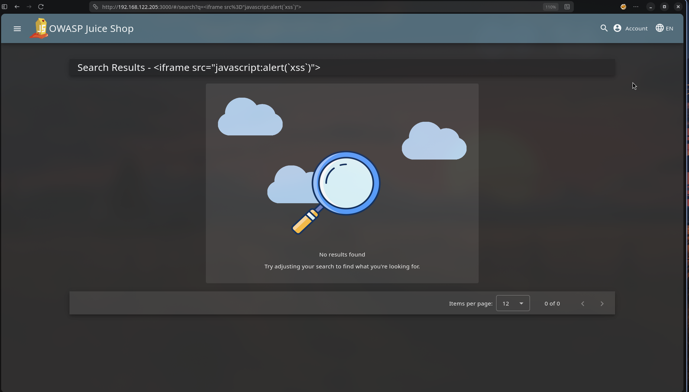
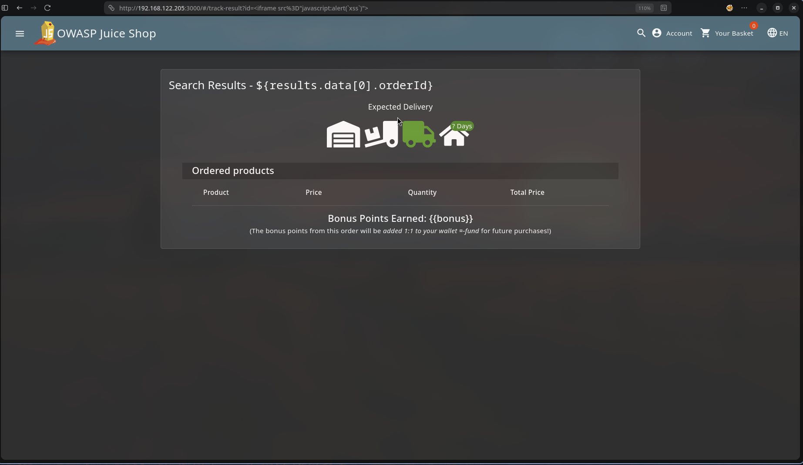
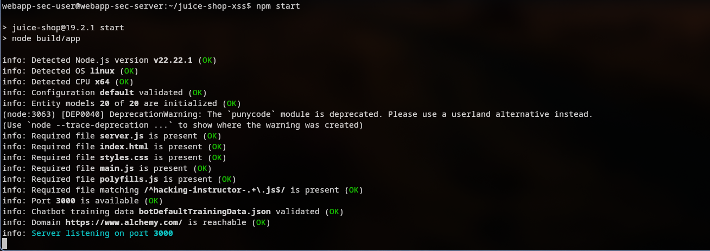

# Cross-Site Scripting (XSS) – Retest Results

## 1. Objective

After implementing the remediation patches described in the prevention document, the previously identified cross-site scripting vulnerabilities were retested to confirm that the attack paths were successfully mitigated.

The retest process aimed to verify that:

```
1. Previously successful payloads no longer execute
   
2. Injected markup is rendered safely or rejected

3. No XSS challenge completion events are triggered

4. Application functionality remains stable
```

---

# 2. DOM-Based XSS Retest

## Test Scenario

The product search feature previously allowed execution of injected HTML via the query parameter.

Original payload used during exploitation:

```
<iframe src="javascript:alert(`xss`)">
```

Injected through:

```
/search?q=<payload>
```

---

## Expected Behavior After Patch

The payload should appear as plain text within the search results and must not execute.

---

## Retest Result

The payload was submitted again through the search functionality.

Observed behavior:

```
Payload is displayed as text

No alert dialog appears

No script execution occurs
```

---

## Evidence

DOM XSS payload rendered safely after patch.



---

# 3. Reflected XSS Retest

## Test Scenario

The order tracking page previously reflected user-controlled input from the URL parameter directly into the DOM.

Example vulnerable endpoint:

```
/track-order?id=<payload>
```

Payload used:

```
<iframe src="javascript:alert(`xss`)">
```

---

## Expected Behavior After Patch

Injected HTML must not execute and should be treated as plain text.

---

## Retest Result

The manipulated tracking URL was accessed again using the same payload.

Observed behavior:

```
Payload does not execute

Alert dialog does not appear

Tracking page loads normally
```

---

## Evidence

Reflected payload fails to execute after patch.



---

# 4. Stored XSS Retest

## Test Scenario

The customer feedback feature previously allowed persistent XSS payloads to be stored and executed when viewed by administrators.

Payload used during testing:

```
<<iframe src="javascript:evil"/>iframe src="javascript:alert(`xss`)">
```

Submitted through the customer feedback form.

---

## Expected Behavior After Patch

Stored feedback should no longer execute injected scripts when displayed in the administration interface.

---

## Retest Result

After submitting the payload and opening the administration panel:

```
No alert dialog appears

Injected payload does not execute

Feedback entry renders safely
```

---

## Evidence

Stored XSS payload does not execute in the administration interface.


---

# 5. Feedback Validation

To ensure the absence of the payload was not caused by empty form submission, an additional validation check was performed.

The application requires the comment field to contain content before submission.

Attempting to submit an empty comment triggers a validation error.

---

## Evidence

Customer feedback form validation preventing empty submission.


---

# 6. Server Log Verification

Server logs were monitored during the retest phase.

Previously, successful exploitation triggered challenge completion events related to the XSS challenges.

After applying the patches:

```
No XSS challenge completion messages appear

No exploit-related server log entries are generated
```

---

## Evidence

Server logs confirm that the XSS challenge was not triggered after patching.



---

# 7. Final Validation Summary

| Vulnerability | Original Behavior                  | Retest Result           |
| ------------- | ---------------------------------- | ----------------------- |
| DOM XSS       | Payload executed in search results | Payload rendered safely |
| Reflected XSS | Payload executed via URL parameter | Payload ignored         |
| Stored XSS    | Payload executed in admin panel    | Payload blocked         |

---

# 8. Conclusion

All previously identified XSS vulnerabilities were successfully mitigated.

The implemented patches eliminated unsafe DOM rendering patterns and introduced appropriate sanitization mechanisms where required.

The retest confirms that:

```
Previously exploitable payloads no longer execute

Application functionality remains stable

No new issues were introduced during remediation
```

The XSS attack surface associated with these features has been effectively removed.

---
