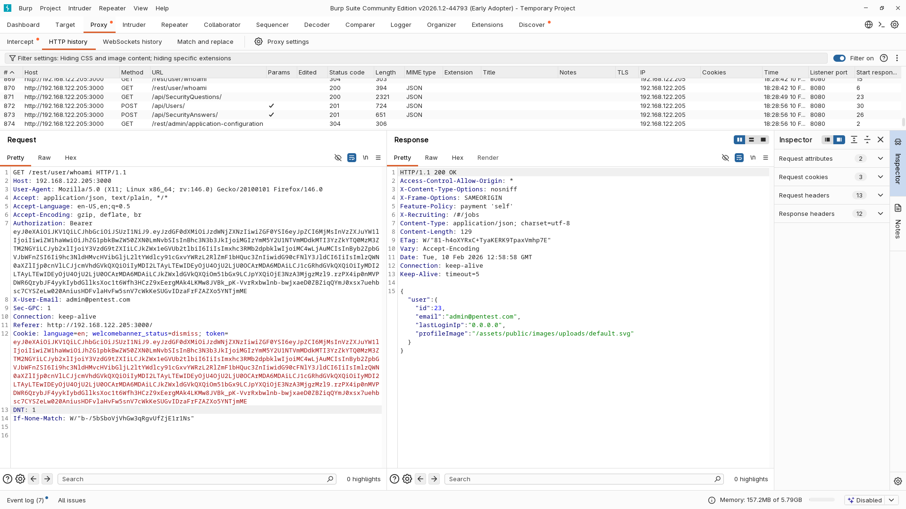
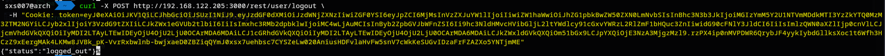
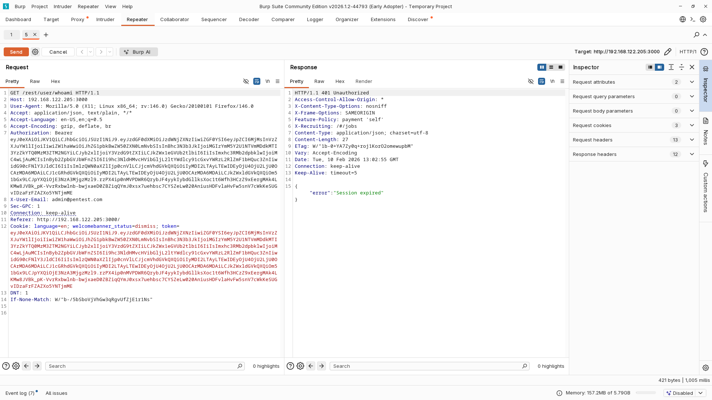
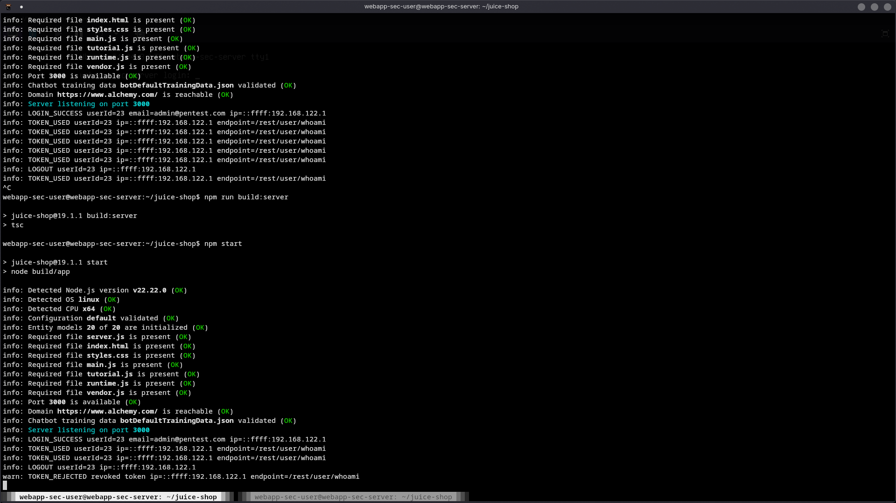

# Final Pentest Results – Broken Authentication

## 1. Objective

Validate that token reuse after logout is no longer possible following:

- Authentication logging implementation
- Server-side logout endpoint
- Token revocation enforcement
---
## 2. Retest Procedure

The original exploit steps were replayed:

1. Login

```
POST /rest/user/login
```

   
2. Access protected endpoint
   
```
GET /rest/user/whoami
```

=> Request successful


3. Logout

```
POST /rest/user/logout
```

=> Logout confirmed
   
   
   
4. Replay previous token via Burp Repeater

```
GET /rest/user/whoami
```

=> using the captured token



---
## 3. Results

### HTTP Response After Logout

```
401 Unauthorized
```

Response body:

```
{ "error": "Session expired" }
```

---
### Server Logs

Observed sequence:

```
LOGIN_SUCCESS userId=23 ...
TOKEN_USED userId=23 ...
LOGOUT userId=23 ...
TOKEN_REJECTED revoked token ip=...
```



---
## 4. Validation Summary

| Control                  | Status        |
| ------------------------ | ------------- |
| Server-side logout       | ✅ Implemented |
| Token revocation         | ✅ Implemented |
| Token reuse after logout | ❌ Blocked     |
| Rejection logging        | ✅ Logged      |

The exploit is no longer reproducible.

---
## 5. Final Status

**Broken Authentication vulnerability: CLOSED**

Session reuse after logout is successfully prevented and fully auditable.

---
