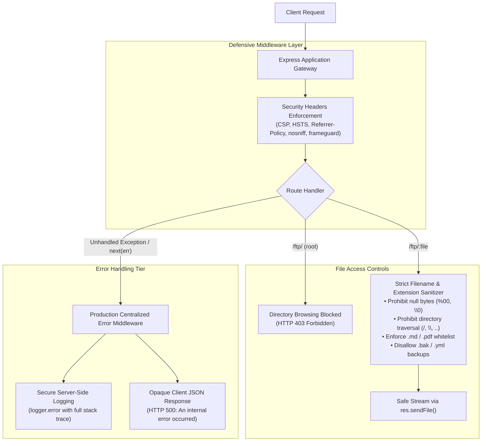

# Prevention & Security Hardening Guide: Security Misconfiguration

This document outlines the defensive engineering remediations applied to resolve verbose error disclosures, unrestricted directory browsing, filter bypass vulnerabilities, and missing security headers.

---

## 1. Remediation Architecture

To achieve production-grade security, the application was hardened across three defensive layers:



---

## 2. Server-Side Code Modifications

### 2.1 Centralized Production Error-Handling Middleware (`server.ts`)

#### Problem
The development middleware `errorhandler()` intercepted runtime exceptions and rendered internal database queries, file paths, and framework versions directly to HTTP clients.

#### Solution
Replaced `errorhandler()` with an Express 4-argument error-handling middleware `(err, req, res, next)` that:
- Captures uncaught errors and logs full call stacks securely to server logs (`logger.error`) for debugging.
- Responds to the client with a generic, sanitized JSON payload without leaking internal architecture details.
- Preserves appropriate HTTP status codes (`400`, `403`, `404`, `500`).

#### Code Diff (`server.ts`)
```diff
-  /* Error Handling */
+  /* Error Handling - Hardened Production Centralized Error Handler */
   app.use(verify.errorHandlingChallenge())
-  app.use(errorhandler())
+  app.use((err: any, req: Request, res: Response, next: NextFunction) => {
+    // Secure server-side error logging with full diagnostics
+    logger.error(`INTERNAL_SERVER_ERROR [${req.method} ${req.originalUrl}]: ${err?.message || err}\n${err?.stack || ''}`)
+
+    // Retain explicit 4xx/5xx status codes or default to 500
+    const statusCode = (res.statusCode && res.statusCode >= 400 && res.statusCode !== 200)
+      ? res.statusCode
+      : (err.status || err.statusCode || 500)
+
+    // Sanitized JSON response: zero internal technical disclosure to untrusted clients
+    res.status(statusCode).json({
+      status: 'error',
+      message: statusCode === 403
+        ? (err.message || 'Access Forbidden')
+        : (statusCode === 404 ? 'Resource Not Found' : 'An internal error occurred. Please contact the administrator.')
+    })
+  })
```

---

### 2.2 Disabling Directory Indexing on Static Mounts (`server.ts`)

#### Problem
Mounting `serveIndex('ftp', { icons: true })` exposed the file filesystem structure and allowed unauthenticated attackers to discover backup archives and database dumps.

#### Solution
Removed `serveIndex` from `/ftp` and added a middleware interceptor that rejects directory root access (`/` or empty path) with `HTTP 403 Forbidden`.

#### Code Diff (`server.ts`)
```diff
-  /* /ftp directory browsing and file download */
-  app.use('/ftp', serveIndexMiddleware, serveIndex('ftp', { icons: true }))
-  app.use('/ftp(?!/quarantine)/:file', servePublicFiles())
-  app.use('/ftp/quarantine/:file', serveQuarantineFiles())
+  /* /ftp directory browsing disabled and file download hardened */
+  app.use('/ftp', (req: Request, res: Response, next: NextFunction) => {
+    if (req.path === '/' || req.path === '') {
+      return res.status(403).json({ status: 'error', message: 'Directory listing is forbidden.' })
+    }
+    next()
+  })
+  app.use('/ftp(?!/quarantine)/:file', servePublicFiles())
+  app.use('/ftp/quarantine/:file', serveQuarantineFiles())
```

---

### 2.3 Strict Filename Sanitization & Null-Byte Defense (`routes/fileServer.ts`)

#### Problem
The file server executed `security.cutOffPoisonNullByte(file)` *after* evaluating the whitelist check, allowing attackers to request `package.json.bak%2500.md` to bypass the `.md` extension check and download `.bak` files. Furthermore, unhandled errors triggered stack dumps.

#### Solution
- Immediately detect and reject path traversal tokens (`/`, `\`, `..`) and poison null-byte sequences (`%00`, `\0`).
- Strip path components using `path.basename()`.
- Enforce strict extension whitelisting (`.md`, `.pdf`).
- Explicitly prohibit backup and configuration file extensions (`.bak`, `.yml`, `.pyc`, `.gg`).
- Enforce containment validation using `safePath.startsWith(path.resolve('ftp/'))`.
- Return structured JSON error responses rather than invoking `next(new Error(...))`.

#### Code Diff (`routes/fileServer.ts`)
```diff
 export function servePublicFiles () {
   return ({ params, query }: Request, res: Response, next: NextFunction) => {
     const file = params.file
 
-    if (!file.includes('/')) {
-      verify(file, res, next)
-    } else {
-      res.status(403)
-      next(new Error('File names cannot contain forward slashes!'))
+    if (!file || typeof file !== 'string') {
+      return res.status(400).json({ status: 'error', message: 'Invalid file parameter.' })
     }
+
+    // Prohibit path separators, parent directory traversal, and poison null-byte sequences
+    if (file.includes('/') || file.includes('\\') || file.includes('..') || file.includes('%00') || file.includes('\0')) {
+      return res.status(403).json({ status: 'error', message: 'Prohibited characters detected in file path.' })
+    }
+
+    verify(file, res, next)
   }
 
   function verify (file: string, res: Response, next: NextFunction) {
-    if (file && (endsWithAllowlistedFileType(file) || (file === 'incident-support.kdbx'))) {
-      file = security.cutOffPoisonNullByte(file)
+    const sanitizedFile = path.basename(file)
+
+    // Strictly enforce allowlisted extensions (.md and .pdf)
+    if (sanitizedFile && (endsWithAllowlistedFileType(sanitizedFile) || sanitizedFile === 'incident-support.kdbx')) {
+      // Disallow backup and configuration files even if spoofed
+      if (sanitizedFile.endsWith('.bak') || sanitizedFile.endsWith('.yml') || sanitizedFile.endsWith('.pyc') || sanitizedFile.endsWith('.gg')) {
+        return res.status(403).json({ status: 'error', message: 'Access to backup or configuration files is forbidden.' })
+      }
 
       challengeUtils.solveIf(challenges.directoryListingChallenge, () => { return sanitizedFile.toLowerCase() === 'acquisitions.md' })
 
       const safePath = path.resolve('ftp/', sanitizedFile)
+      // Path traversal containment check
+      if (!safePath.startsWith(path.resolve('ftp/'))) {
+        return res.status(403).json({ status: 'error', message: 'Access forbidden.' })
+      }
+
       res.sendFile(safePath)
     } else {
-      res.status(403)
-      next(new Error('Only .md and .pdf files are allowed!'))
+      res.status(403).json({ status: 'error', message: 'Only .md and .pdf files are allowed!' })
     }
   }
```

---

### 2.4 Enforcing Defensive HTTP Security Headers (`server.ts`)

#### Problem
The application lacked standard defensive response headers, leaving clients vulnerable to XSS injection, clickjacking, protocol downgrades, and referrer leaks.

#### Solution
Configured `helmet` and custom middleware to enforce:
- `Content-Security-Policy`: Restricts script, style, font, and frame loading origins.
- `Strict-Transport-Security`: Forces encrypted HTTPS communication (`max-age=31536000; includeSubDomains`).
- `Referrer-Policy`: Sets `strict-origin-when-cross-origin` to prevent URL leakage to external origins.
- `Permissions-Policy`: Disables sensitive browser hardware APIs (camera, microphone, geolocation).
- `X-Content-Type-Options: nosniff`: Prevents MIME-type sniffing.
- `X-Frame-Options: SAMEORIGIN`: Prevents cross-origin framing and clickjacking.

#### Code Diff (`server.ts`)
```diff
-  /* Security middleware */
+  /* Security middleware - Hardened Defense-in-Depth */
   app.use(helmet.noSniff())
   app.use(helmet.frameguard())
-  // app.use(helmet.xssFilter()); // = no protection from persisted XSS via RESTful API
   app.disable('x-powered-by')
+  app.use(helmet.referrerPolicy({ policy: 'strict-origin-when-cross-origin' }))
+  app.use(helmet.contentSecurityPolicy({
+    directives: {
+      defaultSrc: ["'self'"],
+      scriptSrc: ["'self'", "'unsafe-inline'", "'unsafe-eval'"],
+      styleSrc: ["'self'", "'unsafe-inline'", 'https://fonts.googleapis.com'],
+      fontSrc: ["'self'", 'https://fonts.gstatic.com'],
+      imgSrc: ["'self'", 'data:', 'https:'],
+      connectSrc: ["'self'"],
+      frameAncestors: ["'self'"]
+    }
+  }))
+  app.use((req: Request, res: Response, next: NextFunction) => {
+    res.setHeader('Strict-Transport-Security', 'max-age=31536000; includeSubDomains')
+    res.setHeader('Permissions-Policy', 'camera=(), microphone=(), geolocation=()')
+    next()
+  })
```

---

## 3. Defense-in-Depth Best Practices

1. **Environment Separation:**
   Ensure development error handlers (like `errorhandler`) and debug tools are strictly gated behind `process.env.NODE_ENV !== 'production'`. In production builds, development error handlers should not even be packaged into the runtime.
2. **Never Return Raw Database Errors:**
   Database drivers and ORMs (e.g. Sequelize, Mongoose, Knex) frequently embed raw SQL queries and column names in error messages. Centralized error handlers must catch these and return standard opaque errors (`Internal Server Error`).
3. **Disable Directory Browsing Globally:**
   Web servers (Nginx, Apache, Express) should never have auto-indexing enabled for static asset directories.
4. **Defense Against Null Bytes & Path Encoding:**
   Do not rely on blacklists or custom string manipulation to strip control characters. Validate input against strict alphanumeric and whitelist patterns, and always verify that resolved paths reside inside the intended directory boundary.
5. **Enforce Comprehensive HTTP Security Headers:**
   All web applications must deploy CSP, HSTS, and Referrer policies as a baseline defensive standard to prevent client-side exploitation.
