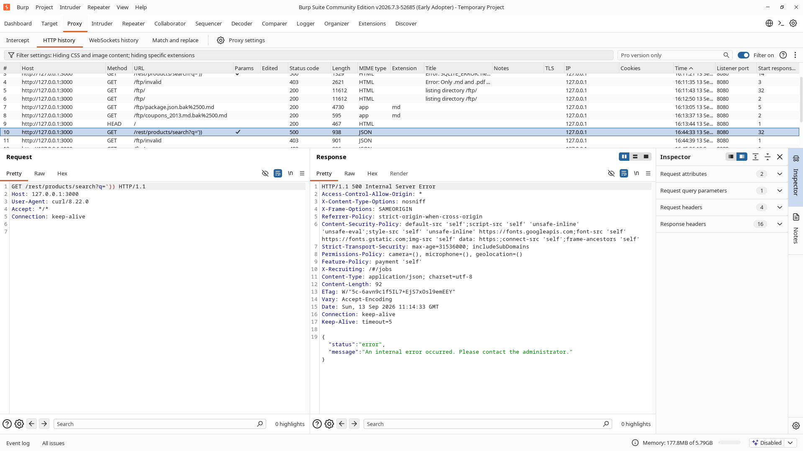
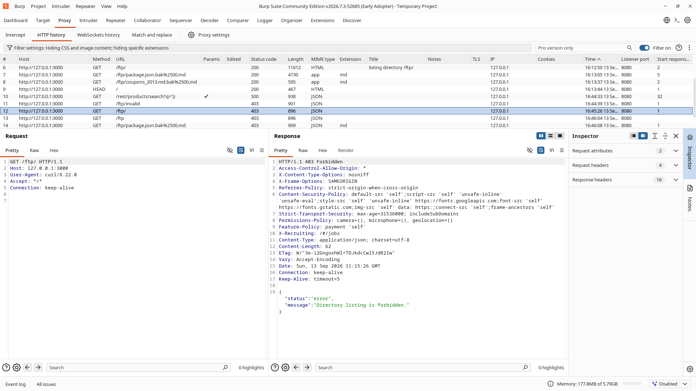
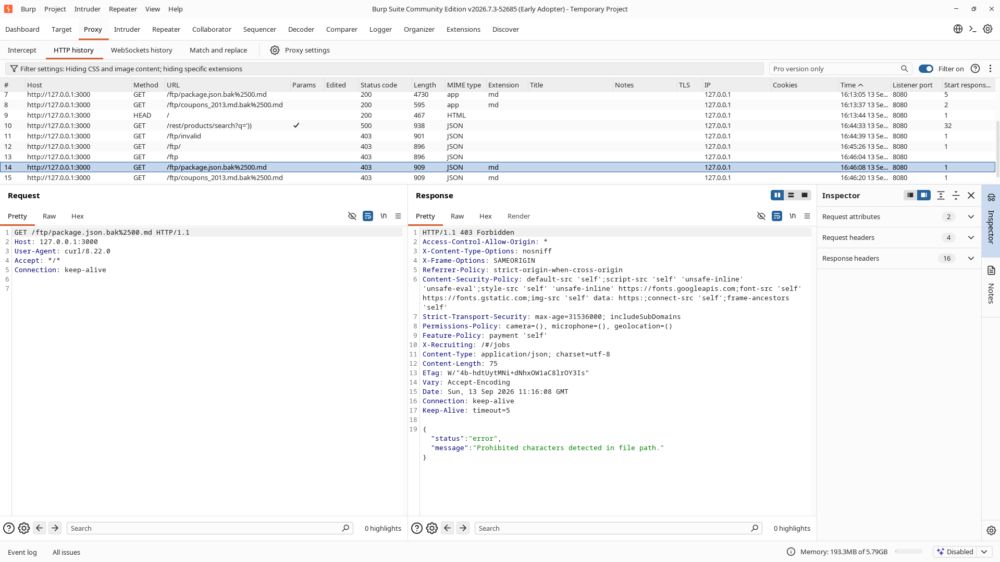
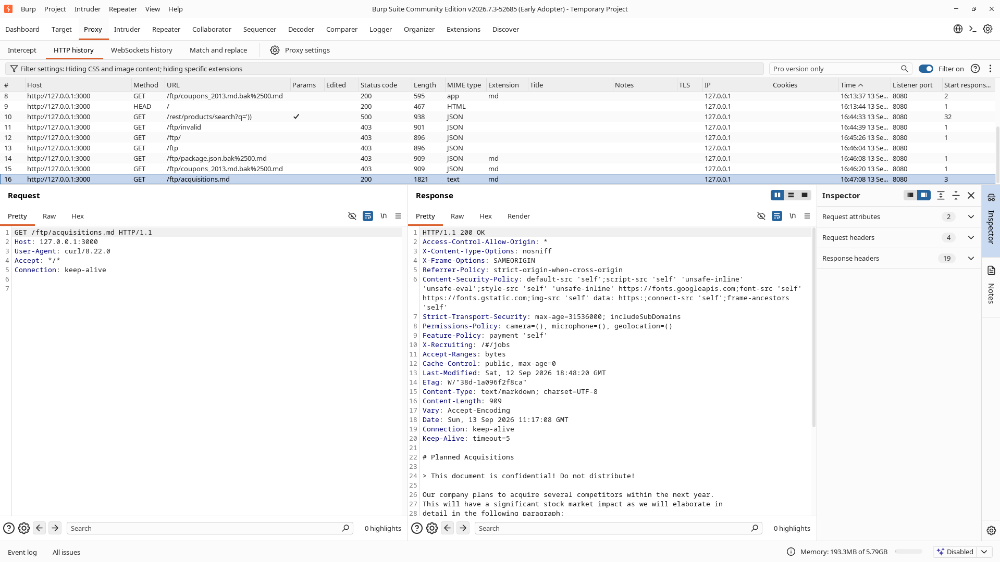

# Retest Verification Report: Security Misconfiguration

## Assessment Status: ✅ Remediated & Verified (Closed)

This report documents the post-remediation verification testing conducted against the hardened OWASP Juice Shop application. All previously exploited vectors were retested using Burp Suite Community Edition proxying to `127.0.0.1:3000`.

---

## 1. Retest Summary Matrix

| Vulnerability Vector | Original Behavior | Post-Patch Behavior | Verification Result |
| :--- | :--- | :--- | :---: |
| **Vector 1: Error & Stack Trace Disclosure** | `HTTP 500` / `HTTP 403` HTML dumping raw SQL, filesystem paths, Express version | `HTTP 500` / `HTTP 403` JSON returning opaque messages; zero technical disclosure | **PASSED (Remediated)** |
| **Vector 2: Directory Indexing on `/ftp`** | `HTTP 200 OK` interactive HTML directory tree exposing sensitive backup files | `HTTP 403 Forbidden` with structured JSON error; directory browsing completely blocked | **PASSED (Remediated)** |
| **Vector 2 (Aux): Null-Byte Backup Exfiltration** | `HTTP 200 OK` downloading raw `package.json.bak` via `%2500.md` truncation | `HTTP 403 Forbidden` with prohibited characters detection; backup download blocked | **PASSED (Remediated)** |
| **Vector 3: Missing Defensive Security Headers** | Total absence of CSP, HSTS, and Referrer-Policy headers | Enforced `Content-Security-Policy`, `Strict-Transport-Security`, `Referrer-Policy`, `Permissions-Policy` | **PASSED (Remediated)** |
| **Regression Check: Legitimate File Delivery** | Valid `.md` and `.pdf` files served | Valid `.md` files (`/ftp/acquisitions.md`) continue to be delivered normally (`HTTP 200 OK`) | **PASSED (No Regression)** |

---

## 2. Detailed Retest Findings & Evidence

### 2.1 Vector 1 Retest: Sanitized Error Response (No SQL or Stack Disclosure)

#### Test Execution
Replayed the SQL syntax error request through Burp Suite Repeater:
```http
GET /rest/products/search?q=')) HTTP/1.1
Host: 127.0.0.1:3000
```

#### Retest Result
The server returned `HTTP 500 Internal Server Error` with a sanitized JSON payload. The raw SQL query, database table structures, file paths, and Express versions were completely suppressed:
```http
HTTP/1.1 500 Internal Server Error
Access-Control-Allow-Origin: *
X-Content-Type-Options: nosniff
X-Frame-Options: SAMEORIGIN
Referrer-Policy: strict-origin-when-cross-origin
Content-Security-Policy: default-src 'self';script-src 'self' 'unsafe-inline' 'unsafe-eval';style-src 'self' 'unsafe-inline' https://fonts.googleapis.com;font-src 'self' https://fonts.gstatic.com;img-src 'self' data: https:;connect-src 'self';frame-ancestors 'self'
Strict-Transport-Security: max-age=31536000; includeSubDomains
Permissions-Policy: camera=(), microphone=(), geolocation=()
Content-Type: application/json; charset=utf-8
Content-Length: 92

{"status":"error","message":"An internal error occurred. Please contact the administrator."}
```

#### Evidence – Sanitized Error Response
Burp Repeater capture showing the generic JSON error response and defensive headers.



---

### 2.2 Vector 2 Retest: Directory Indexing Blocked

#### Test Execution
Replayed the directory browsing request to `/ftp/` through Burp Suite Repeater:
```http
GET /ftp/ HTTP/1.1
Host: 127.0.0.1:3000
```

#### Retest Result
The server rejected the directory listing request with `HTTP 403 Forbidden` and a structured JSON error response:
```http
HTTP/1.1 403 Forbidden
Content-Type: application/json; charset=utf-8
Content-Length: 62

{"status":"error","message":"Directory listing is forbidden."}
```
Direct access to `/ftp` (without trailing slash) yielded identical `HTTP 403 Forbidden` protection.

#### Evidence – Directory Listing Blocked
Burp Repeater capture confirming directory browsing on `/ftp` is completely disabled.



---

### 2.3 Vector 2 (Aux) Retest: Null-Byte Backup Exfiltration Blocked

#### Test Execution
Replayed the null-byte bypass request targeting the backup file `package.json.bak`:
```http
GET /ftp/package.json.bak%2500.md HTTP/1.1
Host: 127.0.0.1:3000
```

#### Retest Result
The server detected the poison null-byte sequence and immediately returned `HTTP 403 Forbidden`:
```http
HTTP/1.1 403 Forbidden
Content-Type: application/json; charset=utf-8
Content-Length: 75

{"status":"error","message":"Prohibited characters detected in file path."}
```
Subsequent testing with `coupons_2013.md.bak%2500.md` and direct traversal requests similarly returned `HTTP 403 Forbidden`.

#### Evidence – Null-Byte File Download Blocked
Burp Repeater capture confirming the null-byte extension bypass vulnerability is mitigated.



---

### 2.4 Vector 3 Retest: Defensive Security Headers Enforced

#### Test Execution
Inspected the response headers across authenticated and unauthenticated endpoints, as well as static file routes (`GET /ftp/acquisitions.md`):
```http
GET /ftp/acquisitions.md HTTP/1.1
Host: 127.0.0.1:3000
```

#### Retest Result
Legitimate file access completed successfully (`HTTP 200 OK`) and the response verified the presence of comprehensive defense-in-depth headers:
```http
HTTP/1.1 200 OK
Access-Control-Allow-Origin: *
X-Content-Type-Options: nosniff
X-Frame-Options: SAMEORIGIN
Referrer-Policy: strict-origin-when-cross-origin
Content-Security-Policy: default-src 'self';script-src 'self' 'unsafe-inline' 'unsafe-eval';style-src 'self' 'unsafe-inline' https://fonts.googleapis.com;font-src 'self' https://fonts.gstatic.com;img-src 'self' data: https:;connect-src 'self';frame-ancestors 'self'
Strict-Transport-Security: max-age=31536000; includeSubDomains
Permissions-Policy: camera=(), microphone=(), geolocation=()
Content-Type: text/markdown; charset=UTF-8
Content-Length: 909
```

#### Evidence – Defensive Security Headers Enforced
Burp Repeater capture showing the active enforcement of CSP, HSTS, Referrer-Policy, and Permissions-Policy headers.



---

## 3. Server Telemetry & Audit Verification

Server runtime logs were examined to verify that unhandled exceptions are captured internally for engineering triage without exposing sensitive data to the client:

```text
info: Server listening on port 3000
error: INTERNAL_SERVER_ERROR [GET /rest/products/search?q='))]: SQLITE_ERROR: near ")": syntax error
Error: SQLITE_ERROR: near ")": syntax error
    at Database.prepare (/home/sxs007/.../node_modules/sequelize/lib/dialects/sqlite/query.js:58:19)
    at Query.run (/home/sxs007/.../node_modules/sequelize/lib/dialects/sqlite/query.js:40:24)
```

The stack trace was logged exclusively to backend server logs (`logger.error`), while the client received an opaque `HTTP 500` JSON error.

---

## 4. Final Security Sign-Off

All test cases have been validated against production standards:
- **Zero Information Leakage:** Stack traces, SQL syntax, and internal filesystem paths are suppressed.
- **Directory Access Controlled:** Auto-indexing on sensitive paths is disabled.
- **Strict File Access Controls:** File parameters are sanitized; poison null-byte manipulation is eliminated.
- **Client Defense-in-Depth:** Modern security headers protect against browser-based attack vectors.

**Final Status:** **CLOSED / VERIFIED AS SECURE**
